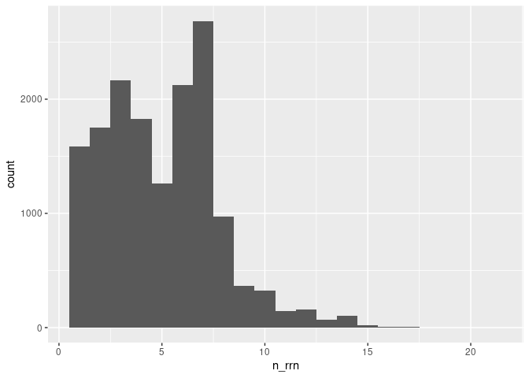
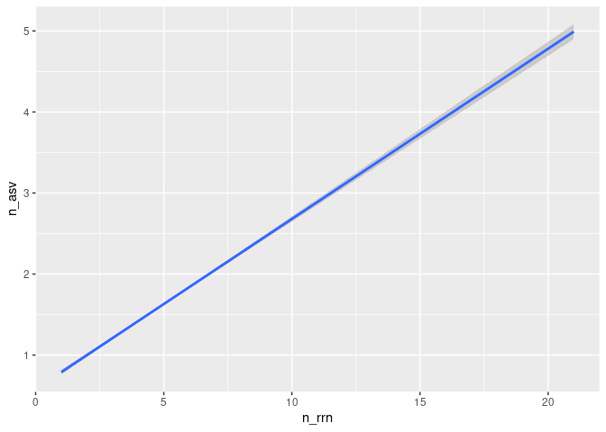

Analyzing the sensitivity and specificity of ASVs for discriminating
between genomes
================
Vaibhav Gawde
2023-06-21

``` r
library(tidyverse)
library(here)
```

### Need to determine the number of *rrn* operons accross the v34 regions of the genomes

Our analysis will use only the v34 region of the sequences

``` r
v34 <- read_tsv(here("data/v34/rrnDB.count_tibble"))
```

    ## Rows: 25315 Columns: 3
    ## ── Column specification ────────────────────────────────────────────────────────
    ## Delimiter: "\t"
    ## chr (2): asv, genome
    ## dbl (1): count
    ## 
    ## ℹ Use `spec()` to retrieve the full column specification for this data.
    ## ℹ Specify the column types or set `show_col_types = FALSE` to quiet this message.

We want to count and plot the number of copies per genome

``` r
v34 %>% 
  group_by(genome) %>% 
  summarise(n_rrn = sum(count), .groups = "drop") %>% 
  ggplot(aes(x=n_rrn)) + geom_histogram(binwidth = 1)
```

<!-- -->

``` r
v34 %>% 
  group_by(genome) %>% 
  summarise(n_rrn = sum(count), .groups = "drop") %>% 
  count(n_rrn) %>% 
  mutate(fraction = n / sum(n))
```

    ## # A tibble: 20 × 3
    ##    n_rrn     n  fraction
    ##    <dbl> <int>     <dbl>
    ##  1     1  1589 0.102    
    ##  2     2  1749 0.112    
    ##  3     3  2162 0.139    
    ##  4     4  1827 0.117    
    ##  5     5  1259 0.0808   
    ##  6     6  2127 0.137    
    ##  7     7  2684 0.172    
    ##  8     8   974 0.0625   
    ##  9     9   365 0.0234   
    ## 10    10   325 0.0209   
    ## 11    11   144 0.00924  
    ## 12    12   161 0.0103   
    ## 13    13    71 0.00456  
    ## 14    14   105 0.00674  
    ## 15    15    23 0.00148  
    ## 16    16     5 0.000321 
    ## 17    17     5 0.000321 
    ## 18    18     1 0.0000642
    ## 19    19     1 0.0000642
    ## 20    21     1 0.0000642

We see that most genomes actually have more than one copy of the *rrn*
operon. Are those copies the same sequence / ASV..?

### Determine number of ASVs per genome

Considering most genomes have multiple copies of the *rrn* operon, we
need to know whether they are the same ASV. Otherwise we run the risk of
splitting a single genome into multiple ASVs.

``` r
v34 %>% 
  group_by(genome) %>% 
  summarise(n_asv = n(), n_rrn = sum(count)) %>% 
  group_by(n_rrn) %>% 
  summarise(mean_n_asv = mean(n_asv),
            lq_n_asv = quantile(n_asv, prob = 0.25),
            uq_n_asv = quantile(n_asv, prob = 0.75)) 
```

    ## # A tibble: 20 × 4
    ##    n_rrn mean_n_asv lq_n_asv uq_n_asv
    ##    <dbl>      <dbl>    <dbl>    <dbl>
    ##  1     1       1           1        1
    ##  2     2       1.11        1        1
    ##  3     3       1.12        1        1
    ##  4     4       1.27        1        1
    ##  5     5       1.49        1        2
    ##  6     6       1.45        1        2
    ##  7     7       2.10        1        3
    ##  8     8       3.24        2        5
    ##  9     9       2.26        1        3
    ## 10    10       2.86        2        4
    ## 11    11       2.79        2        4
    ## 12    12       2.82        1        4
    ## 13    13       2.85        2        4
    ## 14    14       3.15        2        4
    ## 15    15       4           2        5
    ## 16    16       2.4         2        3
    ## 17    17       5.6         3        6
    ## 18    18       4           4        4
    ## 19    19       4           4        4
    ## 20    21       3           3        3

``` r
v34 %>% 
  group_by(genome) %>% 
  summarise(n_asv = n(), n_rrn = sum(count)) %>% 
  ggplot(aes(x=n_rrn, y=n_asv)) + geom_smooth(method="lm")
```

    ## `geom_smooth()` using formula = 'y ~ x'

<!-- -->

We can see that the number of ASVs increase at a rate of about 5 ASV per
20 copies of *rrn* operon of the v34 region in the genome

### Determine whether an ASV is unique to genomes they’re found in

Instead of looking at the number of ASVs per genome, we want to see the
number of genomes per ASV.

``` r
v34 %>% 
  group_by(asv) %>% 
  summarise(n_genomes = n()) %>% 
  count(n_genomes) %>% 
  mutate(fraction = n/sum(n))
```

    ## # A tibble: 86 × 3
    ##    n_genomes     n fraction
    ##        <int> <int>    <dbl>
    ##  1         1  7246  0.779  
    ##  2         2   947  0.102  
    ##  3         3   365  0.0392 
    ##  4         4   167  0.0179 
    ##  5         5   111  0.0119 
    ##  6         6    70  0.00752
    ##  7         7    61  0.00656
    ##  8         8    43  0.00462
    ##  9         9    28  0.00301
    ## 10        10    24  0.00258
    ## # ℹ 76 more rows

We see that with the v34 region, almost 78% of the ASVs were unique to a
genome

### Now we’ll see that if the sensitivity and specificity changes if we look at even shorter region of the genome, only the v4 region

We know that the v4 region is less diverse than the v34. So does the
number of ASVs per genome differ than for v34?

``` r
v4 <- read_tsv(here("data/v4/rrnDB.count_tibble"))
```

    ## Rows: 19778 Columns: 3
    ## ── Column specification ────────────────────────────────────────────────────────
    ## Delimiter: "\t"
    ## chr (2): asv, genome
    ## dbl (1): count
    ## 
    ## ℹ Use `spec()` to retrieve the full column specification for this data.
    ## ℹ Specify the column types or set `show_col_types = FALSE` to quiet this message.

``` r
v4 %>% 
  group_by(genome) %>% 
  summarise(n_rrn = sum(count), .groups = "drop") %>% 
  ggplot(aes(x=n_rrn)) + geom_histogram(binwidth = 1)
```

<!-- -->

``` r
v4 %>% 
  group_by(genome) %>% 
  summarise(n_rrn = sum(count), .groups = "drop") %>% 
  count(n_rrn) %>% 
  mutate(fraction = n / sum(n))
```

    ## # A tibble: 20 × 3
    ##    n_rrn     n  fraction
    ##    <dbl> <int>     <dbl>
    ##  1     1  1589 0.102    
    ##  2     2  1749 0.112    
    ##  3     3  2162 0.139    
    ##  4     4  1827 0.117    
    ##  5     5  1259 0.0808   
    ##  6     6  2127 0.137    
    ##  7     7  2684 0.172    
    ##  8     8   974 0.0625   
    ##  9     9   365 0.0234   
    ## 10    10   325 0.0209   
    ## 11    11   144 0.00924  
    ## 12    12   161 0.0103   
    ## 13    13    71 0.00456  
    ## 14    14   105 0.00674  
    ## 15    15    23 0.00148  
    ## 16    16     5 0.000321 
    ## 17    17     5 0.000321 
    ## 18    18     1 0.0000642
    ## 19    19     1 0.0000642
    ## 20    21     1 0.0000642

Determining the number of ASVs per genome

``` r
v34 %>% 
  group_by(genome) %>% 
  summarise(n_asv = n(), n_rrn = sum(count)) %>% 
  group_by(n_rrn) %>% 
  summarise(mean_n_asv = mean(n_asv),
            lq_n_asv = quantile(n_asv, prob = 0.25),
            uq_n_asv = quantile(n_asv, prob = 0.75)) 
```

    ## # A tibble: 20 × 4
    ##    n_rrn mean_n_asv lq_n_asv uq_n_asv
    ##    <dbl>      <dbl>    <dbl>    <dbl>
    ##  1     1       1           1        1
    ##  2     2       1.11        1        1
    ##  3     3       1.12        1        1
    ##  4     4       1.27        1        1
    ##  5     5       1.49        1        2
    ##  6     6       1.45        1        2
    ##  7     7       2.10        1        3
    ##  8     8       3.24        2        5
    ##  9     9       2.26        1        3
    ## 10    10       2.86        2        4
    ## 11    11       2.79        2        4
    ## 12    12       2.82        1        4
    ## 13    13       2.85        2        4
    ## 14    14       3.15        2        4
    ## 15    15       4           2        5
    ## 16    16       2.4         2        3
    ## 17    17       5.6         3        6
    ## 18    18       4           4        4
    ## 19    19       4           4        4
    ## 20    21       3           3        3

``` r
v34 %>% 
  group_by(genome) %>% 
  summarise(n_asv = n(), n_rrn = sum(count)) %>% 
  ggplot(aes(x=n_rrn, y=n_asv)) + geom_smooth(method="lm")
```

    ## `geom_smooth()` using formula = 'y ~ x'

<!-- -->

We can see that the number of ASVs increase at a rate of about 2.5 ASV
per 20 copies of *rrn* operon of the v4 region in the genome

Now let’s look at the specificity of an ASV for a genome

``` r
v4 %>% 
  group_by(asv) %>% 
  summarise(n_genomes = n()) %>% 
  count(n_genomes) %>% 
  mutate(fraction = n/sum(n))
```

    ## # A tibble: 80 × 3
    ##    n_genomes     n fraction
    ##        <int> <int>    <dbl>
    ##  1         1  4592  0.759  
    ##  2         2   633  0.105  
    ##  3         3   260  0.0430 
    ##  4         4   120  0.0198 
    ##  5         5    80  0.0132 
    ##  6         6    49  0.00810
    ##  7         7    40  0.00661
    ##  8         8    31  0.00512
    ##  9         9    25  0.00413
    ## 10        10    22  0.00364
    ## # ℹ 70 more rows

We find that with the v4 region, almost 76% of the ASVs were unique to a
genome

### To be continued…

- Can we correct for over representation?
- Consider analysis at species, genus, family, etc. levels
- Consider a broader definition of ASVs
