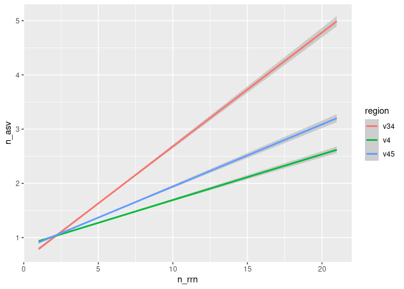

Analyzing the sensitivity and specificity of ASVs for discriminating
between genomes
================
Vaibhav Gawde
2023-06-21

``` r
library(tidyverse)
library(here)
```

### Need to determine the number of *rrn* operons accross the v34 regions of the genomes

``` r
count_tibble <- read_tsv(here("data/processed/rrnDB.count_tibble"), 
                         col_types = "cccd")
```

We want to count and plot the number of copies per genome We’ll maybe do
this for the **v4** sub-region as an example

``` r
count_tibble %>% 
  filter(region == "v4") %>% 
  group_by(genome) %>% 
  summarise(n_rrn = sum(count), .groups = "drop") %>% 
  ggplot(aes(x=n_rrn)) + geom_histogram(binwidth = 1)
```

<!-- -->

``` r
count_tibble %>% 
  filter(region == "v4") %>% 
  group_by(genome) %>% 
  summarise(n_rrn = sum(count)) %>% 
  count(n_rrn) %>% 
  mutate(fraction = n / sum(n))
```

    ## # A tibble: 20 × 3
    ##    n_rrn     n  fraction
    ##    <dbl> <int>     <dbl>
    ##  1     1  1589 0.102    
    ##  2     2  1749 0.112    
    ##  3     3  2162 0.139    
    ##  4     4  1827 0.117    
    ##  5     5  1259 0.0808   
    ##  6     6  2127 0.137    
    ##  7     7  2684 0.172    
    ##  8     8   974 0.0625   
    ##  9     9   365 0.0234   
    ## 10    10   325 0.0209   
    ## 11    11   144 0.00924  
    ## 12    12   161 0.0103   
    ## 13    13    71 0.00456  
    ## 14    14   105 0.00674  
    ## 15    15    23 0.00148  
    ## 16    16     5 0.000321 
    ## 17    17     5 0.000321 
    ## 18    18     1 0.0000642
    ## 19    19     1 0.0000642
    ## 20    21     1 0.0000642

We see that most genomes actually have more than one copy of the *rrn*
operon. Are those copies the same sequence / ASV..?

### Determine number of ASVs per genome

Considering most genomes have multiple copies of the *rrn* operon, we
need to know whether they are the same ASV. Otherwise we run the risk of
splitting a single genome into multiple ASVs.

Now we’ll take into account all the sub-regions that we’ve extracted ie
v4, v34, v45

``` r
count_tibble %>% 
  group_by(region, genome) %>% 
  summarise(n_asv = n(), n_rrn = sum(count)) %>% 
  group_by(region, n_rrn) %>% 
  summarise(med_n_asv = median(n_asv),
            mean_n_asv = mean(n_asv),
            lq_n_asv = quantile(n_asv, prob = 0.25),
            uq_n_asv = quantile(n_asv, prob = 0.75)) %>% 
  filter(n_rrn == 7)
```

    ## `summarise()` has grouped output by 'region'. You can override using the
    ## `.groups` argument.
    ## `summarise()` has grouped output by 'region'. You can override using the
    ## `.groups` argument.

    ## # A tibble: 3 × 6
    ## # Groups:   region [3]
    ##   region n_rrn med_n_asv mean_n_asv lq_n_asv uq_n_asv
    ##   <chr>  <dbl>     <dbl>      <dbl>    <dbl>    <dbl>
    ## 1 v34        7         2       2.10        1        3
    ## 2 v4         7         1       1.48        1        2
    ## 3 v45        7         1       1.64        1        2

``` r
count_tibble %>% 
  group_by(region, genome) %>% 
  summarise(n_asv = n(), n_rrn = sum(count)) %>% 
  ggplot(aes(x=n_rrn, y=n_asv, color=region)) + geom_smooth(method="lm")
```

    ## `summarise()` has grouped output by 'region'. You can override using the
    ## `.groups` argument.
    ## `geom_smooth()` using formula = 'y ~ x'

<!-- -->

We can see that the sub-region **v34** has more number of ASVs per
genome than **v4** and **v45**. **v4** is common between them so it just
says that the **v3** region has more number of unique ASVs than **v5**
region.

### Determine whether an ASV is unique to genomes they’re found in

Instead of looking at the number of ASVs per genome, we want to see the
number of genomes per ASV.

``` r
count_tibble %>% 
  group_by(region, asv) %>% 
  summarise(n_genomes = n()) %>% 
  count(n_genomes) %>% 
  mutate(fraction = n/sum(n)) %>% 
  filter(n_genomes == 1)
```

    ## `summarise()` has grouped output by 'region'. You can override using the
    ## `.groups` argument.

    ## # A tibble: 3 × 4
    ## # Groups:   region [3]
    ##   region n_genomes     n fraction
    ##   <chr>      <int> <int>    <dbl>
    ## 1 v34            1  7246    0.779
    ## 2 v4             1  4592    0.759
    ## 3 v45            1  5717    0.778

We can see that with the these sub-region, how many % of the ASVs were
unique to a genome
